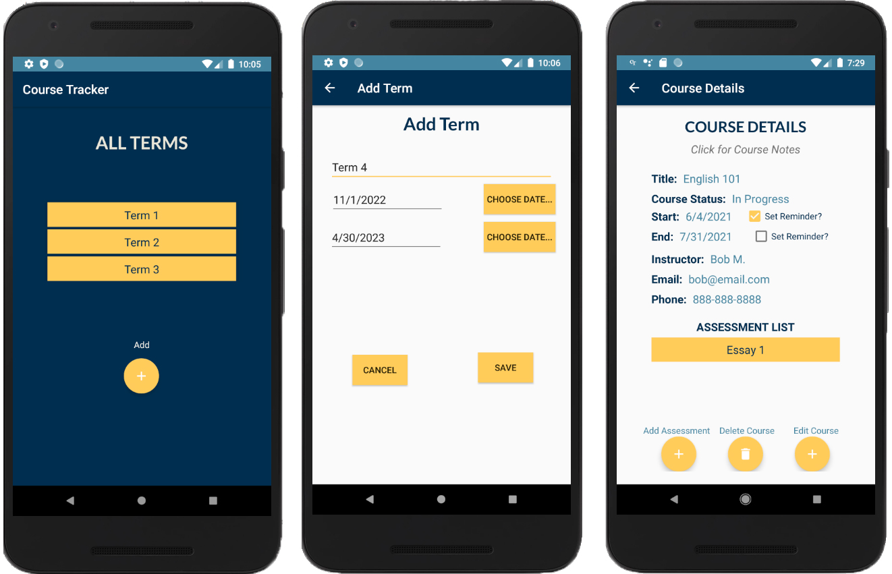

CourseTracker
-------------
*Course Tracker created for WGU's Mobile App Development course.*

Features
--------
- Add, edit, and delete terms 
- Add associated courses to each term
- Add associated assessments to each course
- Course notes for each course, and email notes 
- Reminders for upcoming courses and assessments

Technologies
---------
- Java
- Android Studio

